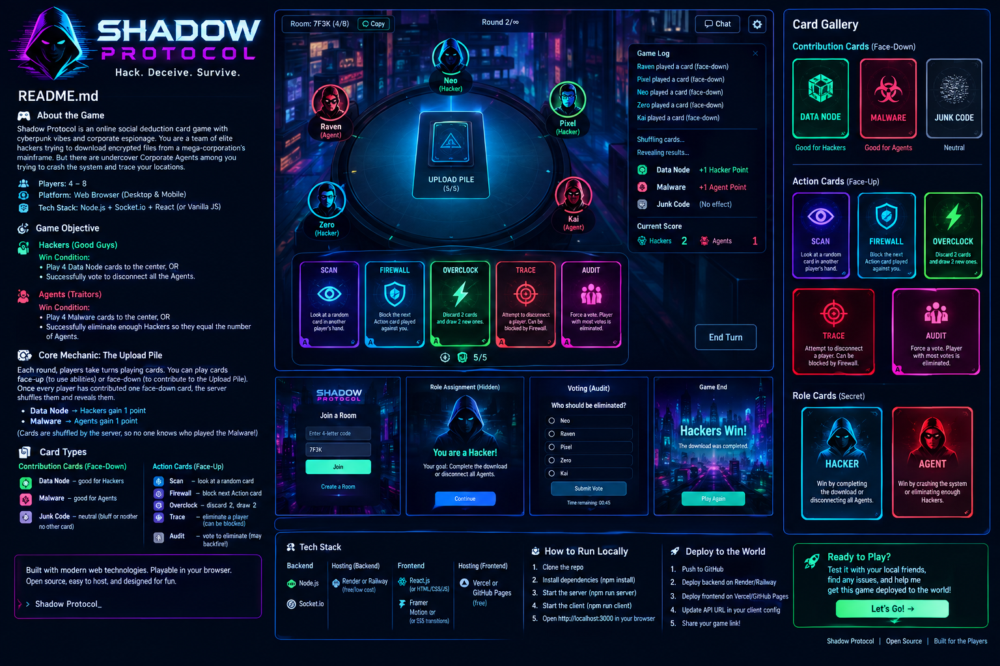

# Shadow Protocol

A fast, browser-based social deduction game built with Node.js, Express, and Socket.IO. Players join a room, hide their role, bluff through the table, and use tactical actions to outmaneuver rivals in a cyberpunk-themed contest of deception, timing, and information warfare.

<p align="center">
  
</p>

## Overview

Shadow Protocol is a multiplayer social deduction card game for 4–8 players. The round table is divided between hidden corporate agents and hostile hackers, each trying to manipulate the system while denying the truth to everyone else. Players are constantly balancing hidden information, strategic card play, and social pressure as they try to expose the truth before their opponents take control.

This project is intentionally lightweight and easy to run: a Node.js server handles room management and authoritative game state, while the browser client renders the game in real time with no build pipeline required.

## Why this project matters

This repository is more than a simple card game prototype. It demonstrates a complete real-time multiplayer structure in a compact form:

- a live browser-based multiplayer game loop
- socket-driven room creation and joining
- reconnect-safe state management
- secret-role gameplay logic
- validation of actions and votes on the server
- a polished UI with minimal dependencies

It is an excellent example of a lightweight but fully functional social deduction game built for local play and quick iteration.

## Key features

- Browser-based multiplayer gameplay for 4–8 players
- Real-time room creation, joining, reconnect handling, and session restoration
- Server-authoritative game state for roles, hands, and contributions
- Action cards including Scan, Firewall, Overclock, Trace, and Audit
- Hidden-role win conditions and round-based progression
- Built-in smoke tests and simulation tooling
- Responsive, cyberpunk-styled single-page interface
- No frontend build step required

## What this game is

This repo contains a game called Shadow Protocol. It is:

- a social deduction game
- a bluffing and inference game
- a cyberpunk-themed card battle
- a multiplayer game with hidden roles
- designed for short, intense rounds of deception and strategy

In short:

- the server is authoritative
- the client only sees what it is allowed to see
- hidden information stays hidden
- players bluff, read behavior, and manipulate the table

## The core concept

The game creates a tense table where:

- most players are Hackers
- a few are secret Agents
- Agents know each other
- Hackers do not know who is on their side
- players attempt to infer identities from actions, timing, and card choice

This creates the classic hidden-role social deduction experience:

- information is incomplete
- every move can be deceptive
- your card play communicates intent
- your timing becomes part of the bluff

## How the game works

Each turn, players take part in a structure designed to blend deduction, sabotage, and resource control:

1. A player may optionally play one Action card face-up.
2. They then upload one card face-down to the shared pile.
3. After all players have uploaded, the pile is revealed and scored.
4. The game tracks points and status for both factions.
5. The next round begins with new decisions, new risks, and new suspicions.

There are two main factions competing for control:

- Hackers
- Agents

The game is not just about card values. It is about reading the table, signaling intent, and deciding whether a move is honest, deceptive, or a trap.

## Roles and player counts

The game is tuned for 4 to 8 players.

Role distribution:

- 4 players = 1 Agent
- 5 players = 1 Agent
- 6 players = 2 Agents
- 7 players = 2 Agents
- 8 players = 3 Agents

Important detail:

- Agents know each other.
- Hackers do not.
- This creates asymmetry and suspicion.

The result is a game where hidden information creates a strong social layer, and every action becomes a signal.

## Card scoring and reveal phase

The reveal phase is where the round’s hidden information becomes public.

During scoring:

- Data Node = +1 for Hackers
- Malware = +1 for Agents
- anything else counts as Junk Code

This means the common pile matters strategically. Players are not just deciding what to play; they are deciding which faction they want to strengthen or weaken.

If a player contributes:

- Data Nodes, they help the Hackers
- Malware, they help the Agents
- Junk Code, they help neither side

Because the pile is public after reveal, every upload can become a social clue. A person may intentionally contribute a card that helps the enemy in order to make their own intent look more believable or to misdirect suspicion.

## Win conditions

### Hackers win by:

- reaching 6 Data Nodes, or
- disconnecting every Agent

### Agents win by:

- reaching 3–5 Malware, depending on player count, or
- having at least as many surviving Agents as Hackers alive

The exact Malware target depends on player count:

- 4 players: 4 Malware
- 5 players: 3 Malware
- 6 players: 5 Malware
- 7 players: 4 Malware
- 8 players: 5 Malware

This creates a game where victory is driven by both outcome and pressure. The players are not simply scoring cards; they are trying to control the table and steer the information environment.

## Action cards

Action cards are a core part of the game and provide tactical tools for sabotage, defense, and information gathering.

### Scan

- peeks at a random card in another player’s hand
- provides information without fully exposing identity
- useful for confirming suspicion or testing a bluff

### Firewall

- blocks the next action aimed at you
- acts as self-defense
- helps protect a player from being targeted during a critical moment

### Overclock

- targets a player and makes them cycle two cards
- disrupts their hand and strategic plan
- creates uncertainty and resource management pressure

### Trace

- disconnects a player
- burns one of your own cards
- publicly reveals that you were the actor
- high-risk, high-information move

### Audit

- starts a vote
- requires a majority to pass
- no tie is allowed
- ejecting an innocent Hacker costs the Hackers 1 Data Node

Audit is especially powerful because it turns the game into a political contest rather than just a tactical one. Players must decide whether to trust accusations, gauge hidden motives, and accept risk in a public vote.

## Turn timer and pressure

The game includes time pressure to prevent stagnation and force decisive play.

- turn timer: 90 seconds
- if a player times out, their card auto-uploads
- if a player is offline, the timer becomes 10 seconds

This creates urgency and drives decision-making. Slow players are punished, and inactivity can reveal the structure of a play pattern.

The timer also makes the game feel more dynamic and tense, because each round becomes a contest of timing, risk, and confidence.

## Why it feels like a social deduction game

The real engine of Shadow Protocol is not only cards. It is the interplay of:

- bluffing
- reading behavior
- sensing false confidence
- interpreting aggression or passivity
- deciding whether blame is genuine or planted

This is what makes the game feel like social deduction:

- nobody knows everyone’s alignment
- each move is a signal
- each action can be truthful, false, or misleading
- the table shifts based on who you trust and who you suspect

A player can look harmless while actually being the strongest threat, and a desperate move can be either a cover or a genuine attempt at control.

## Project structure

```text
.
├── shadow-protocol-fixed-1/
│   └── shadow-protocol/
│       ├── public/
│       │   ├── app.js
│       │   ├── index.html
│       │   ├── style.css
│       │   └── assets/
│       ├── test/
│       │   ├── sim.js
│       │   └── smoke.js
│       ├── game.js
│       ├── package.json
│       ├── README.md
│       ├── RELEASE_NOTES.md
│       ├── server.js
│       └── package-lock.json
└── README.md
```

## Architecture

The application uses a simple but effective real-time architecture:

- `server.js` creates the Express server and Socket.IO server
- `game.js` contains the authoritative room and game logic
- `public/index.html` renders the browser UI shell
- `public/app.js` handles client-side interaction and socket events
- `public/style.css` defines the visual presentation
- `test/` contains validation and simulation scripts

The server is the source of truth. It validates actions, enforces rules, protects hidden information, and prevents invalid or duplicated player control.

## Running locally

From the project directory:

```bash
cd shadow-protocol-fixed-1/shadow-protocol
npm install
npm start
```

Then open:

```text
http://localhost:3000
```

To play locally, open multiple browser tabs or share the host computer’s LAN IP with others on the same network.

## Development scripts

```bash
npm start      # start the server
npm run dev    # watch mode for development
npm run sim    # run bot simulations and rough win-rate checks
npm test       # run end-to-end socket validation tests
```

## Deployment

This project is suitable for lightweight hosting platforms such as Render.

Typical Render configuration:

- Build command: `npm install`
- Start command: `npm start`

The game keeps rooms in memory, so redeploys or temporary sleep cycles can reset active sessions.

## Hardening notes

This release includes improvements over the original local-play version:

- server-authoritative hidden roles, hands, and contribution ownership
- stronger room-code generation
- stricter reconnect logic to prevent duplicate player control
- vote resolution when a majority is mathematically locked
- regression and simulation tests for reliability
- cyberpunk visual artwork included in the project assets

## Full game summary in one sentence

Shadow Protocol is a hidden-role cyberpunk card battle where Hackers try to manipulate the pile and outnumber or eliminate Agents, while Agents try to hide, survive, and accumulate Malware while reading the table and seeding doubt in everyone else.

## License

This project does not currently include a repository-wide license file. If you plan to distribute or reuse it publicly, confirm the intended licensing terms before publication.

## Additional resources

For extra project details, see:

- `shadow-protocol-fixed-1/shadow-protocol/README.md`
- `shadow-protocol-fixed-1/shadow-protocol/RELEASE_NOTES.md`

These files contain the game-specific documentation and the release notes for the hardened version of the project.

## Final note

Shadow Protocol is a compact, polished social deduction game that is easy to run locally, simple to extend, and engaging for small groups. It is especially well suited for casual playtesting, multiplayer demos, and lightweight browser-game experimentation.
